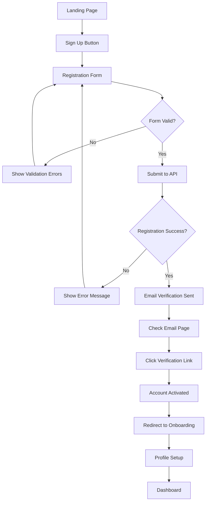
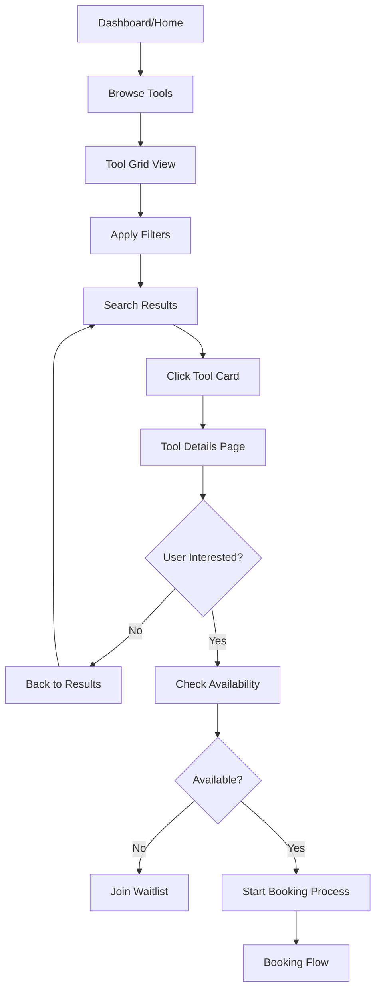
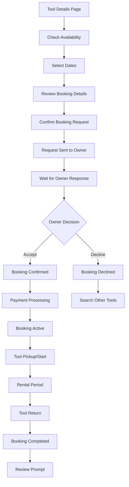

# User Flows and State Management for Wippestoolen Tool-Sharing Platform

## User Flow Overview

The Wippestoolen platform supports five core user journeys:
1. **Authentication Flow** - Registration, login, profile management
2. **Tool Discovery Flow** - Browse, search, and view tool details
3. **Booking Flow** - Request, confirm, and manage tool rentals
4. **Review Flow** - Rate and review tools and users after rental completion
5. **Notification Flow** - Receive and manage real-time updates

## 1. Authentication Flow

### User Registration Journey


### State Management for Authentication
```typescript
// stores/authStore.ts
import { create } from 'zustand'
import { persist, devtools } from 'zustand/middleware'

interface User {
  id: string
  email: string
  name: string
  phone?: string
  location?: string
  rating: number
  is_verified: boolean
}

interface AuthState {
  // State
  user: User | null
  token: string | null
  refreshToken: string | null
  isLoading: boolean
  error: string | null

  // Actions
  login: (email: string, password: string) => Promise<boolean>
  register: (userData: RegisterData) => Promise<boolean>
  logout: () => void
  refreshAuthToken: () => Promise<boolean>
  updateProfile: (updates: Partial<User>) => Promise<boolean>
  clearError: () => void
}

export const useAuthStore = create<AuthState>()(
  devtools(
    persist(
      (set, get) => ({
        // Initial state
        user: null,
        token: null,
        refreshToken: null,
        isLoading: false,
        error: null,

        // Login action
        login: async (email, password) => {
          set({ isLoading: true, error: null })
          
          try {
            const response = await fetch('/api/v1/auth/login', {
              method: 'POST',
              headers: { 'Content-Type': 'application/json' },
              body: JSON.stringify({ email, password })
            })

            if (!response.ok) {
              const errorData = await response.json()
              throw new Error(errorData.detail || 'Login failed')
            }

            const data = await response.json()
            
            set({
              user: data.user,
              token: data.access_token,
              refreshToken: data.refresh_token,
              isLoading: false
            })

            return true
          } catch (error) {
            set({ 
              error: error instanceof Error ? error.message : 'Login failed',
              isLoading: false 
            })
            return false
          }
        },

        // Register action
        register: async (userData) => {
          set({ isLoading: true, error: null })
          
          try {
            const response = await fetch('/api/v1/auth/register', {
              method: 'POST',
              headers: { 'Content-Type': 'application/json' },
              body: JSON.stringify(userData)
            })

            if (!response.ok) {
              const errorData = await response.json()
              throw new Error(errorData.detail || 'Registration failed')
            }

            set({ isLoading: false })
            return true
          } catch (error) {
            set({ 
              error: error instanceof Error ? error.message : 'Registration failed',
              isLoading: false 
            })
            return false
          }
        },

        // Logout action
        logout: () => {
          set({ 
            user: null, 
            token: null, 
            refreshToken: null,
            error: null 
          })
        },

        // Token refresh
        refreshAuthToken: async () => {
          const { refreshToken } = get()
          if (!refreshToken) return false

          try {
            const response = await fetch('/api/v1/auth/refresh', {
              method: 'POST',
              headers: { 
                'Authorization': `Bearer ${refreshToken}`,
                'Content-Type': 'application/json'
              }
            })

            if (!response.ok) throw new Error('Token refresh failed')

            const data = await response.json()
            set({ token: data.access_token })
            return true
          } catch (error) {
            set({ user: null, token: null, refreshToken: null })
            return false
          }
        },

        // Profile update
        updateProfile: async (updates) => {
          const { token } = get()
          if (!token) return false

          try {
            const response = await fetch('/api/v1/users/me', {
              method: 'PUT',
              headers: {
                'Authorization': `Bearer ${token}`,
                'Content-Type': 'application/json'
              },
              body: JSON.stringify(updates)
            })

            if (!response.ok) throw new Error('Profile update failed')

            const updatedUser = await response.json()
            set({ user: updatedUser })
            return true
          } catch (error) {
            set({ error: error instanceof Error ? error.message : 'Update failed' })
            return false
          }
        },

        clearError: () => set({ error: null })
      }),
      {
        name: 'auth-storage',
        partialize: (state) => ({
          user: state.user,
          token: state.token,
          refreshToken: state.refreshToken
        })
      }
    ),
    { name: 'AuthStore' }
  )
)
```

### Authentication Components Integration
```typescript
// pages/login.tsx
const LoginPage = () => {
  const { login, isLoading, error, clearError } = useAuthStore()
  const router = useRouter()
  
  const form = useForm({
    resolver: zodResolver(loginSchema),
    defaultValues: { email: '', password: '' }
  })

  const onSubmit = async (data: LoginFormData) => {
    clearError()
    const success = await login(data.email, data.password)
    
    if (success) {
      const redirect = router.query.redirect as string || '/dashboard'
      router.push(redirect)
    }
  }

  return (
    <div className="min-h-screen flex items-center justify-center">
      <Card className="w-full max-w-md">
        <CardHeader>
          <CardTitle>Welcome Back</CardTitle>
          <CardDescription>Sign in to your Wippestoolen account</CardDescription>
        </CardHeader>
        
        <Form {...form}>
          <form onSubmit={form.handleSubmit(onSubmit)}>
            <CardContent className="space-y-4">
              {error && (
                <Alert variant="destructive">
                  <AlertDescription>{error}</AlertDescription>
                </Alert>
              )}
              
              <FormField
                control={form.control}
                name="email"
                render={({ field }) => (
                  <FormItem>
                    <FormLabel>Email</FormLabel>
                    <FormControl>
                      <Input type="email" {...field} />
                    </FormControl>
                    <FormMessage />
                  </FormItem>
                )}
              />
              
              <FormField
                control={form.control}
                name="password"
                render={({ field }) => (
                  <FormItem>
                    <FormLabel>Password</FormLabel>
                    <FormControl>
                      <Input type="password" {...field} />
                    </FormControl>
                    <FormMessage />
                  </FormItem>
                )}
              />
            </CardContent>
            
            <CardFooter>
              <Button type="submit" className="w-full" disabled={isLoading}>
                {isLoading ? 'Signing in...' : 'Sign In'}
              </Button>
            </CardFooter>
          </form>
        </Form>
      </Card>
    </div>
  )
}
```

## 2. Tool Discovery Flow

### Tool Browsing Journey


### Tool State Management
```typescript
// stores/toolStore.ts
interface Tool {
  id: string
  title: string
  description: string
  category: string
  daily_rate: number
  deposit_amount: number
  image_urls: string[]
  owner_id: string
  owner_name: string
  owner_rating: number
  is_available: boolean
  location: string
  created_at: string
}

interface ToolState {
  // State
  tools: Tool[]
  featuredTools: Tool[]
  searchResults: Tool[]
  categories: Category[]
  filters: SearchFilters
  isLoading: boolean
  error: string | null
  currentTool: Tool | null

  // Actions
  fetchTools: (params?: SearchParams) => Promise<void>
  fetchFeaturedTools: () => Promise<void>
  fetchToolDetails: (id: string) => Promise<void>
  searchTools: (query: string) => Promise<void>
  applyFilters: (filters: SearchFilters) => void
  clearFilters: () => void
  setCurrentTool: (tool: Tool | null) => void
}

export const useToolStore = create<ToolState>()(
  devtools(
    (set, get) => ({
      // Initial state
      tools: [],
      featuredTools: [],
      searchResults: [],
      categories: [],
      filters: {
        category: '',
        location: '',
        priceRange: [0, 100],
        availability: 'all'
      },
      isLoading: false,
      error: null,
      currentTool: null,

      // Fetch tools with pagination
      fetchTools: async (params) => {
        set({ isLoading: true, error: null })
        
        try {
          const queryParams = new URLSearchParams()
          if (params?.page) queryParams.append('page', params.page.toString())
          if (params?.limit) queryParams.append('limit', params.limit.toString())
          if (params?.category) queryParams.append('category', params.category)
          if (params?.location) queryParams.append('location', params.location)
          
          const response = await fetch(`/api/v1/tools?${queryParams}`)
          if (!response.ok) throw new Error('Failed to fetch tools')
          
          const data = await response.json()
          set({ 
            tools: params?.page === 1 ? data.items : [...get().tools, ...data.items],
            isLoading: false 
          })
        } catch (error) {
          set({ 
            error: error instanceof Error ? error.message : 'Failed to fetch tools',
            isLoading: false 
          })
        }
      },

      // Search tools
      searchTools: async (query) => {
        set({ isLoading: true, error: null })
        
        try {
          const { filters } = get()
          const params = new URLSearchParams({
            q: query,
            category: filters.category,
            location: filters.location,
            min_price: filters.priceRange[0].toString(),
            max_price: filters.priceRange[1].toString()
          })
          
          const response = await fetch(`/api/v1/tools/search?${params}`)
          if (!response.ok) throw new Error('Search failed')
          
          const data = await response.json()
          set({ searchResults: data.items, isLoading: false })
        } catch (error) {
          set({ 
            error: error instanceof Error ? error.message : 'Search failed',
            isLoading: false 
          })
        }
      },

      // Apply filters
      applyFilters: (newFilters) => {
        set({ filters: { ...get().filters, ...newFilters } })
        // Re-fetch tools with new filters
        get().fetchTools({ ...newFilters, page: 1 })
      },

      // Fetch tool details
      fetchToolDetails: async (id) => {
        set({ isLoading: true, error: null })
        
        try {
          const response = await fetch(`/api/v1/tools/${id}`)
          if (!response.ok) throw new Error('Tool not found')
          
          const tool = await response.json()
          set({ currentTool: tool, isLoading: false })
        } catch (error) {
          set({ 
            error: error instanceof Error ? error.message : 'Tool not found',
            isLoading: false 
          })
        }
      },

      clearFilters: () => {
        set({ 
          filters: {
            category: '',
            location: '',
            priceRange: [0, 100],
            availability: 'all'
          }
        })
      },

      setCurrentTool: (tool) => set({ currentTool: tool })
    }),
    { name: 'ToolStore' }
  )
)
```

### Tool Discovery Hook Integration
```typescript
// hooks/useToolDiscovery.ts
export const useToolDiscovery = () => {
  const {
    tools,
    searchResults,
    filters,
    isLoading,
    error,
    fetchTools,
    searchTools,
    applyFilters
  } = useToolStore()

  // Auto-fetch tools on mount
  useEffect(() => {
    fetchTools()
  }, [])

  // Debounced search
  const [searchQuery, setSearchQuery] = useState('')
  const debouncedSearch = useMemo(
    () => debounce((query: string) => {
      if (query.trim()) {
        searchTools(query)
      } else {
        fetchTools()
      }
    }, 300),
    []
  )

  useEffect(() => {
    debouncedSearch(searchQuery)
  }, [searchQuery, debouncedSearch])

  // Filter tools based on current filters
  const filteredTools = useMemo(() => {
    let filtered = searchQuery ? searchResults : tools
    
    if (filters.category) {
      filtered = filtered.filter(tool => tool.category === filters.category)
    }
    
    if (filters.availability === 'available') {
      filtered = filtered.filter(tool => tool.is_available)
    }
    
    if (filters.priceRange) {
      filtered = filtered.filter(tool => 
        tool.daily_rate >= filters.priceRange[0] && 
        tool.daily_rate <= filters.priceRange[1]
      )
    }
    
    return filtered
  }, [tools, searchResults, filters, searchQuery])

  return {
    tools: filteredTools,
    searchQuery,
    setSearchQuery,
    filters,
    applyFilters,
    isLoading,
    error
  }
}
```

## 3. Booking Flow

### Booking Process Journey


### Booking State Management
```typescript
// stores/bookingStore.ts
interface Booking {
  id: string
  tool_id: string
  tool_title: string
  tool_image_url?: string
  borrower_id: string
  owner_id: string
  start_date: string
  end_date: string
  status: 'pending' | 'confirmed' | 'active' | 'completed' | 'cancelled' | 'declined'
  total_cost: number
  deposit_amount: number
  delivery_fee?: number
  pickup_location: string
  return_location: string
  special_instructions?: string
  created_at: string
}

interface BookingState {
  // State
  bookings: Booking[]
  currentBooking: Booking | null
  unavailableDates: Date[]
  isLoading: boolean
  error: string | null

  // Actions
  fetchBookings: () => Promise<void>
  fetchUnavailableDates: (toolId: string) => Promise<void>
  createBookingRequest: (bookingData: CreateBookingData) => Promise<boolean>
  updateBookingStatus: (bookingId: string, status: string) => Promise<boolean>
  cancelBooking: (bookingId: string, reason?: string) => Promise<boolean>
  calculateBookingCost: (toolId: string, startDate: Date, endDate: Date) => Promise<number>
}

export const useBookingStore = create<BookingState>()(
  devtools(
    (set, get) => ({
      bookings: [],
      currentBooking: null,
      unavailableDates: [],
      isLoading: false,
      error: null,

      fetchBookings: async () => {
        set({ isLoading: true, error: null })
        
        try {
          const { token } = useAuthStore.getState()
          const response = await fetch('/api/v1/bookings/me', {
            headers: { Authorization: `Bearer ${token}` }
          })
          
          if (!response.ok) throw new Error('Failed to fetch bookings')
          
          const data = await response.json()
          set({ bookings: data.items, isLoading: false })
        } catch (error) {
          set({ 
            error: error instanceof Error ? error.message : 'Failed to fetch bookings',
            isLoading: false 
          })
        }
      },

      fetchUnavailableDates: async (toolId) => {
        try {
          const response = await fetch(`/api/v1/tools/${toolId}/availability`)
          if (!response.ok) throw new Error('Failed to fetch availability')
          
          const data = await response.json()
          const unavailableDates = data.unavailable_dates.map((date: string) => new Date(date))
          set({ unavailableDates })
        } catch (error) {
          console.error('Failed to fetch unavailable dates:', error)
        }
      },

      createBookingRequest: async (bookingData) => {
        set({ isLoading: true, error: null })
        
        try {
          const { token } = useAuthStore.getState()
          const response = await fetch('/api/v1/bookings', {
            method: 'POST',
            headers: {
              'Authorization': `Bearer ${token}`,
              'Content-Type': 'application/json'
            },
            body: JSON.stringify(bookingData)
          })

          if (!response.ok) {
            const errorData = await response.json()
            throw new Error(errorData.detail || 'Booking request failed')
          }

          const booking = await response.json()
          set({ 
            currentBooking: booking, 
            isLoading: false 
          })

          // Refresh bookings list
          get().fetchBookings()
          
          return true
        } catch (error) {
          set({ 
            error: error instanceof Error ? error.message : 'Booking request failed',
            isLoading: false 
          })
          return false
        }
      },

      updateBookingStatus: async (bookingId, status) => {
        try {
          const { token } = useAuthStore.getState()
          const response = await fetch(`/api/v1/bookings/${bookingId}/status`, {
            method: 'PUT',
            headers: {
              'Authorization': `Bearer ${token}`,
              'Content-Type': 'application/json'
            },
            body: JSON.stringify({ status })
          })

          if (!response.ok) throw new Error('Status update failed')

          // Update booking in local state
          set((state) => ({
            bookings: state.bookings.map(booking =>
              booking.id === bookingId ? { ...booking, status } : booking
            )
          }))

          return true
        } catch (error) {
          set({ error: error instanceof Error ? error.message : 'Status update failed' })
          return false
        }
      },

      calculateBookingCost: async (toolId, startDate, endDate) => {
        try {
          const params = new URLSearchParams({
            start_date: startDate.toISOString(),
            end_date: endDate.toISOString()
          })

          const response = await fetch(`/api/v1/tools/${toolId}/cost-estimate?${params}`)
          if (!response.ok) throw new Error('Cost calculation failed')

          const data = await response.json()
          return data.total_cost
        } catch (error) {
          console.error('Cost calculation failed:', error)
          return 0
        }
      },

      cancelBooking: async (bookingId, reason) => {
        try {
          const { token } = useAuthStore.getState()
          const response = await fetch(`/api/v1/bookings/${bookingId}/cancel`, {
            method: 'PUT',
            headers: {
              'Authorization': `Bearer ${token}`,
              'Content-Type': 'application/json'
            },
            body: JSON.stringify({ cancellation_reason: reason })
          })

          if (!response.ok) throw new Error('Cancellation failed')

          // Update local state
          set((state) => ({
            bookings: state.bookings.map(booking =>
              booking.id === bookingId 
                ? { ...booking, status: 'cancelled' } 
                : booking
            )
          }))

          return true
        } catch (error) {
          set({ error: error instanceof Error ? error.message : 'Cancellation failed' })
          return false
        }
      }
    }),
    { name: 'BookingStore' }
  )
)
```

### Booking Flow Components
```typescript
// components/BookingWizard.tsx
interface BookingWizardProps {
  tool: Tool
  onComplete: (booking: Booking) => void
  onCancel: () => void
}

const BookingWizard = ({ tool, onComplete, onCancel }: BookingWizardProps) => {
  const [step, setStep] = useState(1)
  const [bookingData, setBookingData] = useState<Partial<CreateBookingData>>({})
  const { createBookingRequest, calculateBookingCost, isLoading } = useBookingStore()

  const steps = [
    { id: 1, title: 'Select Dates', component: DateSelection },
    { id: 2, title: 'Booking Details', component: BookingDetails },
    { id: 3, title: 'Review & Confirm', component: BookingReview }
  ]

  const handleStepComplete = (data: any) => {
    setBookingData(prev => ({ ...prev, ...data }))
    
    if (step < steps.length) {
      setStep(step + 1)
    } else {
      handleBookingSubmit()
    }
  }

  const handleBookingSubmit = async () => {
    const success = await createBookingRequest({
      tool_id: tool.id,
      ...bookingData
    } as CreateBookingData)

    if (success) {
      onComplete(useBookingStore.getState().currentBooking!)
    }
  }

  const CurrentStepComponent = steps[step - 1].component

  return (
    <Dialog open onOpenChange={() => onCancel()}>
      <DialogContent className="max-w-2xl max-h-[90vh] overflow-y-auto">
        <DialogHeader>
          <DialogTitle>Book {tool.title}</DialogTitle>
          <DialogDescription>
            Step {step} of {steps.length}: {steps[step - 1].title}
          </DialogDescription>
        </DialogHeader>

        {/* Progress indicator */}
        <div className="flex items-center justify-between mb-6">
          {steps.map((s, index) => (
            <div key={s.id} className="flex items-center">
              <div className={`
                w-8 h-8 rounded-full flex items-center justify-center text-sm font-medium
                ${step > s.id ? 'bg-primary text-primary-foreground' : 
                  step === s.id ? 'bg-primary/20 text-primary' : 
                  'bg-muted text-muted-foreground'}
              `}>
                {step > s.id ? <Check className="h-4 w-4" /> : s.id}
              </div>
              {index < steps.length - 1 && (
                <div className={`w-12 h-px mx-2 ${step > s.id ? 'bg-primary' : 'bg-muted'}`} />
              )}
            </div>
          ))}
        </div>

        <CurrentStepComponent
          tool={tool}
          data={bookingData}
          onComplete={handleStepComplete}
          onBack={step > 1 ? () => setStep(step - 1) : undefined}
          isLoading={isLoading}
        />
      </DialogContent>
    </Dialog>
  )
}
```

## 4. Real-time Notifications

### WebSocket State Management
```typescript
// stores/notificationStore.ts
interface Notification {
  id: string
  title: string
  message: string
  type: 'booking_request' | 'booking_update' | 'review_received' | 'payment' | 'general'
  is_read: boolean
  action_url?: string
  created_at: string
}

interface NotificationState {
  notifications: Notification[]
  unreadCount: number
  isConnected: boolean
  preferences: NotificationPreferences

  // Actions
  connectWebSocket: (userId: string) => void
  disconnectWebSocket: () => void
  markAsRead: (notificationId: string) => Promise<void>
  markAllAsRead: () => Promise<void>
  deleteNotification: (notificationId: string) => Promise<void>
  updatePreferences: (prefs: Partial<NotificationPreferences>) => Promise<void>
}

export const useNotificationStore = create<NotificationState>()(
  devtools(
    (set, get) => ({
      notifications: [],
      unreadCount: 0,
      isConnected: false,
      preferences: {
        email_notifications: true,
        push_notifications: true,
        booking_updates: true,
        review_notifications: true,
        marketing_emails: false
      },

      connectWebSocket: (userId) => {
        const { token } = useAuthStore.getState()
        const ws = new WebSocket(`ws://localhost:8002/ws/notifications/${userId}?token=${token}`)

        ws.onopen = () => {
          set({ isConnected: true })
          console.log('WebSocket connected')
        }

        ws.onmessage = (event) => {
          const notification = JSON.parse(event.data)
          
          set((state) => ({
            notifications: [notification, ...state.notifications],
            unreadCount: state.unreadCount + (notification.is_read ? 0 : 1)
          }))

          // Show toast notification
          toast({
            title: notification.title,
            description: notification.message,
            action: notification.action_url ? (
              <ToastAction altText="View" onClick={() => {
                window.location.href = notification.action_url
              }}>
                View
              </ToastAction>
            ) : undefined
          })
        }

        ws.onclose = () => {
          set({ isConnected: false })
          console.log('WebSocket disconnected')
          
          // Attempt to reconnect after 5 seconds
          setTimeout(() => {
            get().connectWebSocket(userId)
          }, 5000)
        }

        ws.onerror = (error) => {
          console.error('WebSocket error:', error)
          set({ isConnected: false })
        }
      },

      markAsRead: async (notificationId) => {
        try {
          const { token } = useAuthStore.getState()
          await fetch(`/api/v1/notifications/${notificationId}/read`, {
            method: 'PUT',
            headers: { Authorization: `Bearer ${token}` }
          })

          set((state) => ({
            notifications: state.notifications.map(n =>
              n.id === notificationId ? { ...n, is_read: true } : n
            ),
            unreadCount: Math.max(0, state.unreadCount - 1)
          }))
        } catch (error) {
          console.error('Failed to mark notification as read:', error)
        }
      },

      markAllAsRead: async () => {
        try {
          const { token } = useAuthStore.getState()
          await fetch('/api/v1/notifications/read-all', {
            method: 'PUT',
            headers: { Authorization: `Bearer ${token}` }
          })

          set((state) => ({
            notifications: state.notifications.map(n => ({ ...n, is_read: true })),
            unreadCount: 0
          }))
        } catch (error) {
          console.error('Failed to mark all notifications as read:', error)
        }
      }
    }),
    { name: 'NotificationStore' }
  )
)
```

### WebSocket Hook Integration
```typescript
// hooks/useWebSocket.ts
export const useWebSocket = () => {
  const { user } = useAuthStore()
  const { connectWebSocket, disconnectWebSocket, isConnected } = useNotificationStore()

  useEffect(() => {
    if (user?.id) {
      connectWebSocket(user.id)
      
      return () => {
        disconnectWebSocket()
      }
    }
  }, [user?.id])

  // Handle visibility changes to manage connection
  useEffect(() => {
    const handleVisibilityChange = () => {
      if (document.visibilityState === 'visible' && user?.id && !isConnected) {
        connectWebSocket(user.id)
      }
    }

    document.addEventListener('visibilitychange', handleVisibilityChange)
    return () => document.removeEventListener('visibilitychange', handleVisibilityChange)
  }, [user?.id, isConnected])

  return { isConnected }
}
```

## 5. Error Handling and Loading States

### Global Error Boundary
```typescript
// components/ErrorBoundary.tsx
interface ErrorBoundaryState {
  hasError: boolean
  error?: Error
}

class ErrorBoundary extends Component<
  { children: ReactNode; fallback?: ComponentType<{ error: Error; reset: () => void }> },
  ErrorBoundaryState
> {
  constructor(props: any) {
    super(props)
    this.state = { hasError: false }
  }

  static getDerivedStateFromError(error: Error): ErrorBoundaryState {
    return { hasError: true, error }
  }

  componentDidCatch(error: Error, errorInfo: ErrorInfo) {
    console.error('Error Boundary caught an error:', error, errorInfo)
    
    // Send error to monitoring service
    // Sentry.captureException(error, { contexts: { react: errorInfo } })
  }

  render() {
    if (this.state.hasError) {
      const FallbackComponent = this.props.fallback || DefaultErrorFallback
      return (
        <FallbackComponent 
          error={this.state.error!} 
          reset={() => this.setState({ hasError: false, error: undefined })}
        />
      )
    }

    return this.props.children
  }
}

const DefaultErrorFallback = ({ error, reset }: { error: Error; reset: () => void }) => (
  <div className="min-h-screen flex items-center justify-center">
    <Card className="w-full max-w-md">
      <CardHeader>
        <CardTitle className="flex items-center space-x-2">
          <AlertTriangle className="h-5 w-5 text-destructive" />
          <span>Something went wrong</span>
        </CardTitle>
        <CardDescription>
          We encountered an unexpected error. Please try again.
        </CardDescription>
      </CardHeader>
      <CardContent>
        <details className="mt-4">
          <summary className="cursor-pointer text-sm text-muted-foreground">
            Error Details
          </summary>
          <pre className="mt-2 text-xs bg-muted p-2 rounded overflow-x-auto">
            {error.message}
          </pre>
        </details>
      </CardContent>
      <CardFooter className="space-x-2">
        <Button onClick={reset}>Try Again</Button>
        <Button variant="outline" onClick={() => window.location.href = '/'}>
          Go Home
        </Button>
      </CardFooter>
    </Card>
  </div>
)
```

### Loading State Management
```typescript
// hooks/useLoadingStates.ts
export const useLoadingStates = () => {
  const authLoading = useAuthStore(state => state.isLoading)
  const toolsLoading = useToolStore(state => state.isLoading)
  const bookingsLoading = useBookingStore(state => state.isLoading)

  const isAnyLoading = authLoading || toolsLoading || bookingsLoading

  return {
    authLoading,
    toolsLoading,
    bookingsLoading,
    isAnyLoading
  }
}

// Global loading indicator
const GlobalLoadingIndicator = () => {
  const { isAnyLoading } = useLoadingStates()

  if (!isAnyLoading) return null

  return (
    <div className="fixed top-0 left-0 right-0 z-50">
      <div className="h-1 bg-primary/20">
        <div className="h-full bg-primary animate-pulse" />
      </div>
    </div>
  )
}
```

## Data Flow Architecture

### Unidirectional Data Flow Pattern
```typescript
// Data flows in one direction:
// User Action → Store Action → API Call → State Update → UI Re-render

// Example: Tool booking flow
const bookingFlow = {
  // 1. User clicks "Book Tool"
  userAction: () => {
    const { createBookingRequest } = useBookingStore.getState()
    createBookingRequest(bookingData)
  },

  // 2. Store action calls API
  storeAction: async (bookingData: CreateBookingData) => {
    set({ isLoading: true })
    const response = await fetch('/api/v1/bookings', {
      method: 'POST',
      body: JSON.stringify(bookingData)
    })
    const booking = await response.json()
    
    // 3. Update state with response
    set({ 
      currentBooking: booking,
      isLoading: false
    })
  },

  // 4. Components re-render automatically
  // due to Zustand subscriptions
}
```

### State Synchronization Strategy
```typescript
// Optimistic updates for better UX
const optimisticUpdate = async (bookingId: string, newStatus: string) => {
  // 1. Immediately update UI (optimistic)
  set((state) => ({
    bookings: state.bookings.map(booking =>
      booking.id === bookingId ? { ...booking, status: newStatus } : booking
    )
  }))

  try {
    // 2. Send request to server
    await updateBookingStatus(bookingId, newStatus)
  } catch (error) {
    // 3. Revert on failure
    set((state) => ({
      bookings: state.bookings.map(booking =>
        booking.id === bookingId ? { ...booking, status: 'pending' } : booking
      )
    }))
    throw error
  }
}
```

This comprehensive user flow and state management architecture ensures a smooth, responsive, and reliable user experience while maintaining clean separation of concerns and enabling easy testing and maintenance.